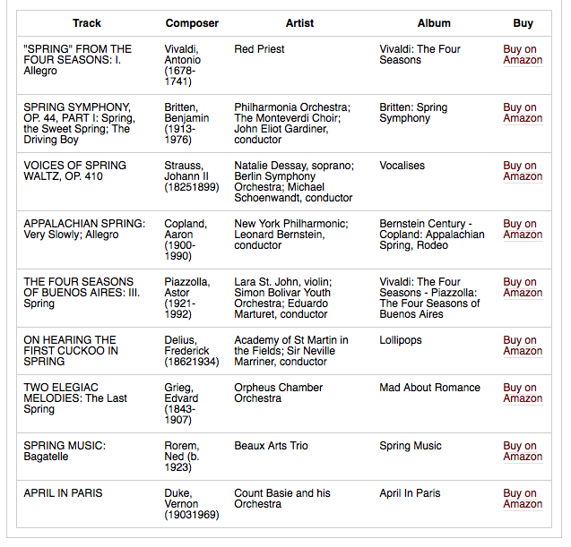

# C2-playlist-wordpress

This simple PHP file can be included in a Wordpress theme in order to fetch and display episode playlists from NPR's Composer 2.

To get started, upload the file to your theme directory, and include it in single.php (or wherever you want to display a playlist).

The Composer 2 API needs three parameters to know which playlist to get: ucs, prog_id, and datestamp.

For the prog_id, you need to set the PHP variable $composer\_prog\_id. Depending on your station site's setup, you might define this in each theme's functions.php file, the options table, a WP category description, or even just in a meta field.

Then, change the ucs JS variable to your own station's UCS.

By default, the script will simply look at the WP post's publish date and look for a playlist for that date.

If you've set these variables correctly, and a playlist is entered into C2 for that episode of a program, you should see a simple HTML table that displays Track, Composer, Artist, and a Buy link for Amazon.

Please feel free to configure this file for your own setup; everything is easily customizable.

